# TripAI · 문화행사에서 시작하는 서울 하루 여행

서울의 문화행사를 먼저 고르면, 그 행사 시간에 맞춰 주변 맛집과 카페를 묶어 **하루 여행 일정을 AI로 추천**하는 웹 서비스입니다.

공공데이터(서울시 문화행사 OpenAPI, 한국관광공사 TourAPI)와 AI를 활용한 지역 생활정보 추천 서비스로, 팀 미니 프로젝트 1로 진행했습니다.

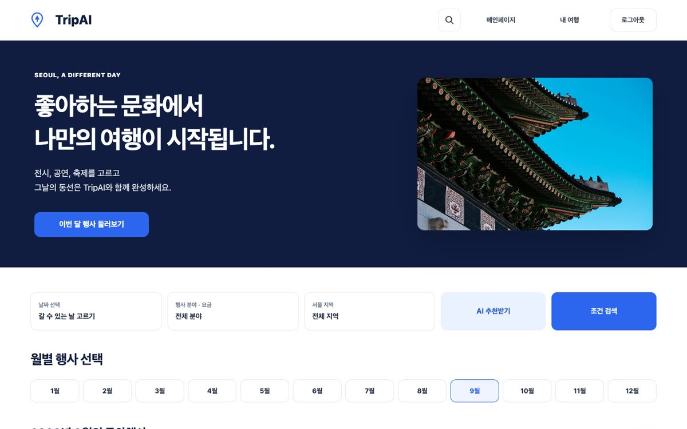

---

## 목차

1. [프로젝트 소개](#1-프로젝트-소개)
2. [주요 기능](#2-주요-기능)
3. [일정 추천 방식](#3-일정-추천-방식)
4. [화면 흐름](#4-화면-흐름)
5. [시스템 구성](#5-시스템-구성)
6. [기술 스택](#6-기술-스택)
7. [데이터](#7-데이터)
8. [API 목록](#8-api-목록)
9. [데이터베이스](#9-데이터베이스)
10. [폴더 구조](#10-폴더-구조)
11. [로컬 실행 방법](#11-로컬-실행-방법)
12. [팀과 협업 방식](#12-팀과-협업-방식)
13. [문서 목록](#13-문서-목록)

---

## 1. 프로젝트 소개

### 만든 이유

여행 일정을 짤 때 보통 관광지를 먼저 정하고, 그 근처에서 할 일을 찾습니다. 그런데 전시·공연·축제처럼 **날짜와 시간이 정해진 문화행사**를 보러 가는 날에는 순서가 반대입니다. 행사 시간이 먼저 정해지고, 그 앞뒤로 어디서 먹고 쉴지를 맞춰야 합니다.

TripAI는 이 순서를 그대로 서비스로 만들었습니다.

| 일반 여행 추천 | TripAI |
|---|---|
| 관광지를 먼저 고릅니다 | **문화행사를 먼저 고릅니다** |
| 장소 중심으로 동선을 만듭니다 | **행사 시작 시간을 고정**하고 그 앞뒤로 식사·카페를 배치합니다 |
| 영업시간은 사용자가 따로 확인합니다 | 방문 시각에 **영업 중이고 브레이크타임이 아닌** 가게만 추천합니다 |

### 한 줄 요약

> 날짜와 취향만 고르면, 그날 진행하는 서울 문화행사와 주변 맛집·카페를 묶어 시간표가 있는 하루 일정을 만들어 줍니다. 만든 일정은 직접 고치고 저장해 두었다가 다시 편집할 수 있습니다.

---

## 2. 주요 기능

### 2-1. 회원

- 이메일 회원가입과 로그인(JWT)을 지원합니다. 로그인하지 않으면 서비스 화면에 들어갈 수 없습니다.
- 로그아웃 API가 늦게 응답해도 화면에서는 바로 로그아웃 상태가 됩니다.

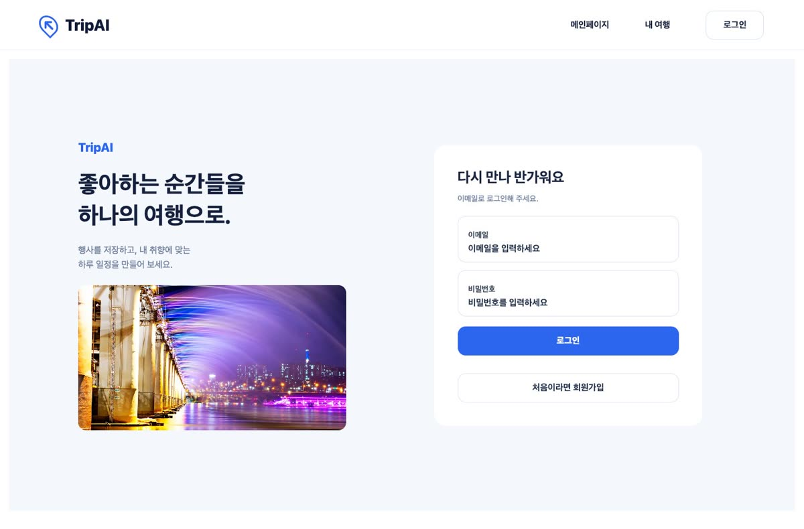

### 2-2. 문화행사 찾기

| 방법 | 설명 |
|---|---|
| 월별 행사 | 메인에서 1월\~12월을 누르면 그달의 행사를 분야별(전체·전시·공연)로 보여 줍니다. 그달에 시작하는 행사가 먼저 나옵니다. |
| 조건 검색 | 갈 수 있는 날(여러 날 선택 가능), 행사 분야, 무료 여부, 서울 25개 구 중 지역을 골라 찾습니다. |
| 키워드 검색 | 모든 화면 상단의 돋보기로 행사명·장소·지역·분야를 검색합니다. |
| 정렬·페이지 | 최근 시작순 등으로 정렬하고, 10개씩 페이지를 넘겨 봅니다. |

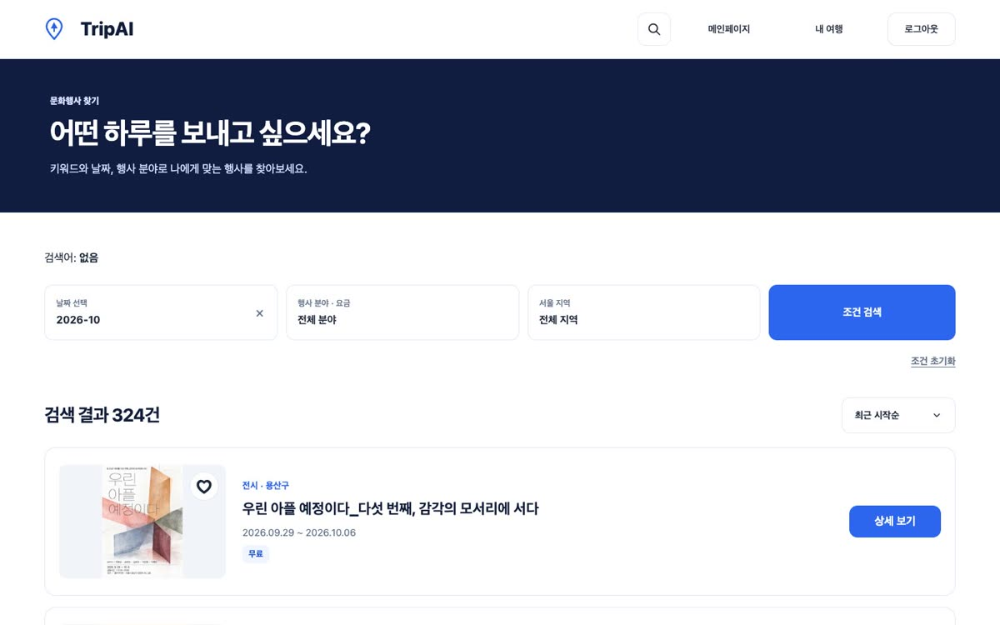

### 2-3. 행사 상세와 관심 행사

- 날짜·시간·지역·장소·요금과 방문 전 확인 사항을 보여 주고, 공식 안내 페이지로 이동할 수 있습니다.
- 하트를 누르면 관심 행사로 저장되어 **내 여행 > 관심 행사**에서 모아 볼 수 있습니다.
- 이 화면에서 바로 **이 행사로 AI 일정 만들기**를 하거나, 이미 저장한 일정에 이 행사를 더할 수 있습니다.

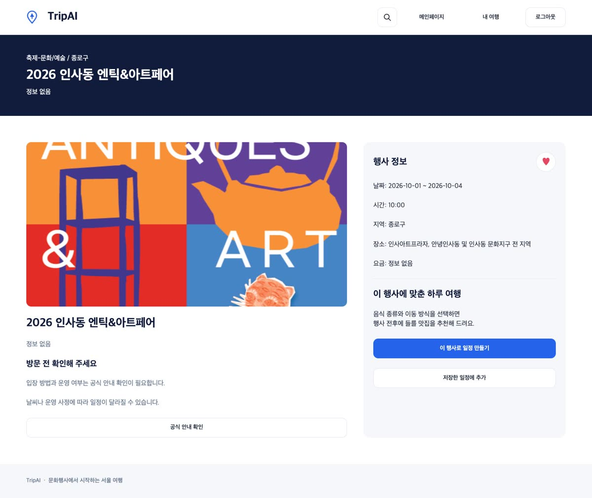

### 2-4. AI 하루 일정 추천

일정은 두 곳에서 시작할 수 있습니다.

| 시작하는 곳 | 고르는 것 | 결과 |
|---|---|---|
| 메인 **AI 추천받기** | 갈 수 있는 날(여러 날), 행사 분야·지역·무료 여부, 이동 방법, 점심·저녁 음식 종류, 카페 포함 여부 | 조건에 맞는 행사와 방문일을 서버가 고르고, 그 행사에 맞춘 하루 일정을 만듭니다. |
| 행사 상세 **이 행사로 AI 일정 만들기** | 행사 기간 안의 날짜 하루, 이동 방법, 점심·저녁 음식 종류, 카페 포함 여부 | 이미 고른 행사를 기준으로 하루 일정을 만듭니다. |

<p>
  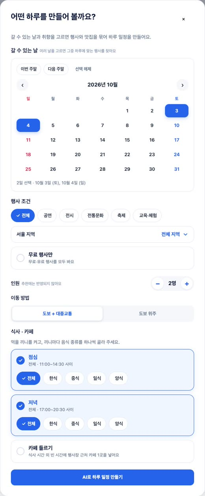
  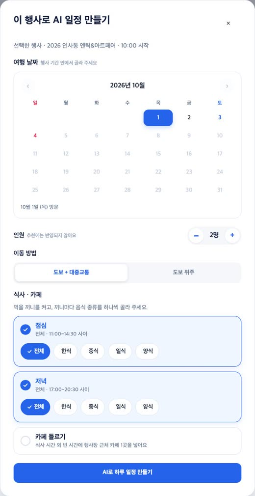
</p>

### 2-5. 나의 일정 (추천 결과 편집)

- 행사 → 점심 → 카페 → 저녁 순서의 **시간표**와 **카카오 지도 동선**(방문 순서 번호, 직선 연결)을 함께 보여 줍니다. 목록과 지도에서 장소를 고르면 서로 따라 움직입니다.
- 장소마다 **추천 이유**(식사 시간대, 행사장에서의 거리, 음식 종류, 영업시간)를 보여 줍니다.
- 방문 시간 변경, 장소 변경, 삭제, 장소 직접 추가를 할 수 있습니다. 두 시간 이상 비는 시간은 따로 알려 주고, 그 시간에 바로 장소를 넣을 수 있습니다.
- **조건 수정**으로 날짜·식사 조건을 바꾸거나, **다시 추천**으로 같은 조건의 다른 코스를 받을 수 있습니다.
- 일정 이름을 바꾸고 저장하면 내 여행에 모입니다.

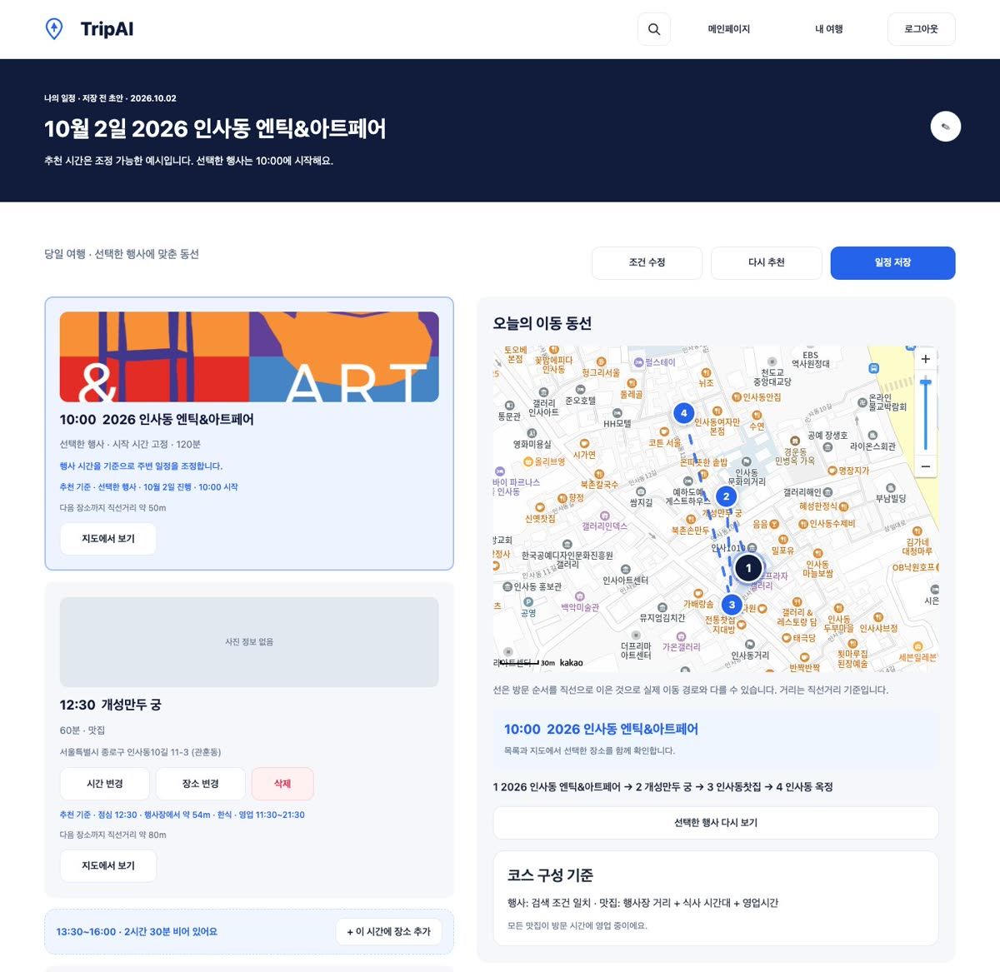

### 2-6. 내 여행

- 저장한 일정이 대표 행사 사진, D-day, 날짜·시간, 방문 코스(번호 순서)가 담긴 카드로 모입니다.
- 일정 보기, 이름 변경, 삭제(확인 창)를 할 수 있고, 저장한 일정도 다시 편집·재추천한 뒤 같은 일정에 반영할 수 있습니다.
- 저장한 일정이나 관심 행사가 없으면 메인으로 안내합니다.

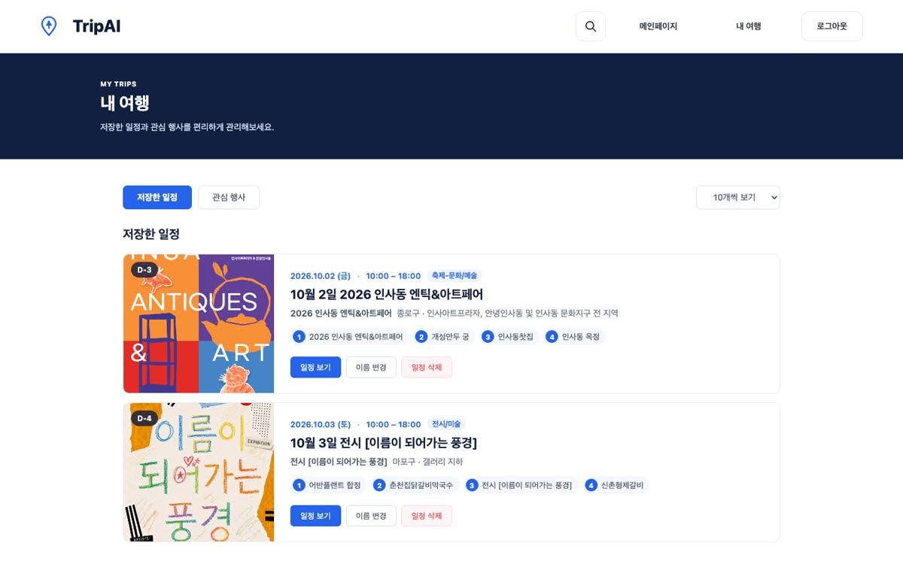

---

## 3. 일정 추천 방식

추천은 **규칙 기반 결과를 먼저 만들고, AI 결과가 같은 규칙 검사를 통과할 때만 AI 결과를 쓰는** 방식입니다. 그래서 AI 응답이 늦거나 틀려도 사용자에게는 항상 규칙에 맞는 일정이 나갑니다.

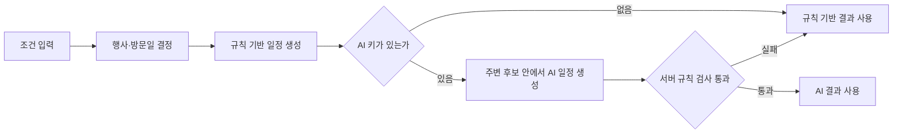

| 규칙 | 내용 |
|---|---|
| 행사 시간 | 행사 시작 시간이 있으면 그 시각에 고정하고, 종료 시간까지(없으면 120분) 머뭅니다. |
| 식사 시간 | 점심 12:30, 저녁 17:00에 60분을 기본으로 두고, 행사와 겹치면 앞뒤로 옮깁니다. 옮긴 시각도 점심 11:00\~14:30, 저녁 17:00\~20:30 안이어야 합니다. |
| 맛집 선택 | 끼니별로 고른 음식 종류(한식·중식·일식·양식) 중, 식사 60분 동안 영업하고 브레이크타임과 겹치지 않는 곳을 행사장에서 가까운 순으로 고릅니다. 반경은 1.5km → 3km → 5km 순서로 넓힙니다. |
| 카페 | 카페 포함을 고르면 식사 시간대가 아닌 빈 시간에 행사장 근처 카페·전통찻집 1곳을 넣습니다. |
| 후보 부족 | 맞는 맛집이 하나도 없으면 일정을 만들지 않고 이유를 알려 줍니다. |
| AI 검사 | 행사 1개와 고정 시간 유지, 후보 안의 장소만 사용, 식사 시간대·영업시간·브레이크타임, 시간 겹침, 규칙 기반보다 식사 수가 적지 않은지, 다시 추천이면 기존 일정과 다른지를 서버에서 다시 확인합니다. |

AI는 OpenAI API(기본 모델 `gpt-4.1-mini`)를 사용하며, 키가 없으면 규칙 기반으로만 동작합니다.

---

## 4. 화면 흐름

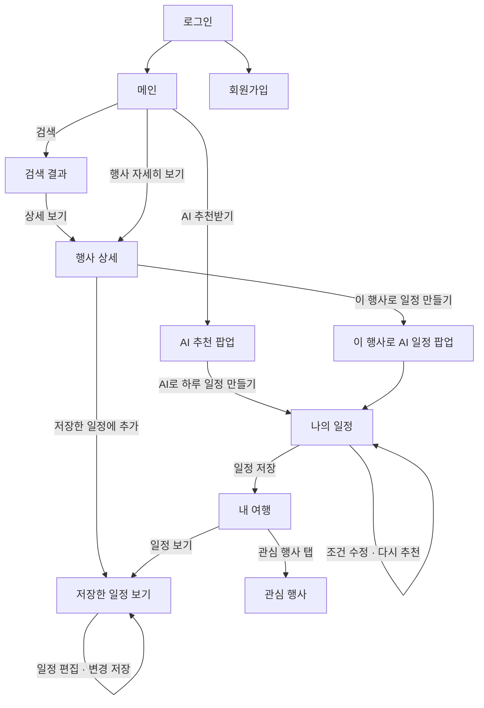

---

## 5. 시스템 구성

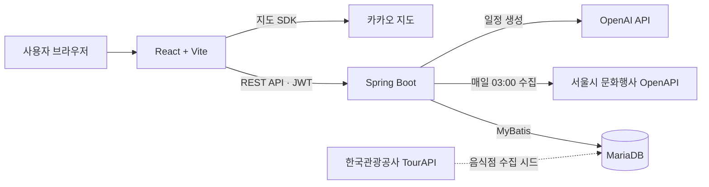

- 문화행사는 매일 새벽 3시에 서울시 OpenAPI에서 수집합니다. 처음 설치할 때는 `BATCH_EVENT_INITIAL_LOAD=true`로 서버를 한 번 실행해 전체를 적재합니다. 온라인 행사는 숨깁니다.
- 음식점·카페는 TourAPI에서 미리 수집해 영업시간과 브레이크타임을 정리한 시드로 넣습니다.
- API 키는 `backend/.env`, `frontend/.env`에만 두고 저장소에는 올리지 않습니다.

---

## 6. 기술 스택

| 구분 | 기술 |
|---|---|
| 프런트엔드 | React 18, Vite 5, React Router 6, Axios, 카카오 지도 JavaScript SDK |
| 백엔드 | Java 17, Spring Boot 3.5, Spring Security, JWT(jjwt), MyBatis, Bean Validation |
| 데이터베이스 | MariaDB (MySQL 호환, `mysql-connector-j`) |
| 외부 API | 서울시 문화행사 OpenAPI, 한국관광공사 TourAPI, OpenAI API, 카카오 지도 |
| 빌드·실행 | Gradle Wrapper, Node.js 22(`.nvmrc`), npm |
| 협업 | GitHub(이슈·PR 템플릿, 코드 리뷰), Figma(와이어프레임), Discord·카카오톡 |

---

## 7. 데이터

| 데이터 | 출처 | 규모 |
|---|---|---|
| 문화행사 | 서울시 문화행사 정보 OpenAPI | 약 19,000건 (매일 갱신) |
| 음식점 | 한국관광공사 TourAPI (서울) | 961곳 수집, 영업시간·좌표·음식 분류가 있는 추천 후보 745곳, 브레이크타임 정리 337곳 |

자세한 수집 과정은 [docs/08](docs/08_TourAPI_음식점_수집.md), [docs/09](docs/09_TourAPI_음식점_수집결과.md), [database/seed](database/seed/README.md)에 있습니다.

---

## 8. API 목록

모든 API는 `/api`로 시작하고, 회원가입·로그인을 제외하면 로그인 토큰이 필요합니다.

| 구분 | 메서드 · 경로 | 설명 |
|---|---|---|
| 회원 | `POST /api/auth/signup` | 회원가입 |
| | `POST /api/auth/login` | 로그인 (JWT 발급) |
| | `POST /api/auth/logout` | 로그아웃 |
| 행사 | `GET /api/events/months/{month}` | 월별 행사 |
| | `GET /api/events` | 키워드·날짜·분야·지역·무료 조건 검색 |
| | `GET /api/events/{eventId}` | 행사 상세 |
| 관심 행사 | `GET /api/favorites/events` | 관심 행사 목록 |
| | `POST /api/favorites/events/{eventContentId}` | 관심 행사 추가 |
| | `DELETE /api/favorites/events/{eventContentId}` | 관심 행사 해제 |
| 장소 | `GET /api/places/restaurants` | 행사 주변 맛집 검색 |
| 일정 추천 | `POST /api/plans/recommend` | 조건 또는 행사 기준 일정 초안 생성 |
| 일정 초안 | `GET /api/plans/drafts/{draftId}` | 초안 조회 |
| | `PATCH /api/plans/drafts/{draftId}/conditions` | 조건 수정 후 다시 만들기 |
| | `POST /api/plans/drafts/{draftId}/regenerate` | 다시 추천 |
| | `PATCH /api/plans/drafts/{draftId}/title` | 이름 변경 |
| | `PUT /api/plans/drafts/{draftId}/items` | 일정 항목 전체 반영 (시간·순서 변경) |
| | `POST /api/plans/drafts/{draftId}/items` | 장소 추가 |
| | `DELETE /api/plans/drafts/{draftId}/items/{itemId}` | 장소 삭제 |
| | `DELETE /api/plans/drafts/{draftId}` | 초안 삭제 |
| | `POST /api/plans/drafts/from-saved/{planId}` | 저장한 일정을 편집용 초안으로 복사 |
| 저장 일정 | `POST /api/plans` | 초안을 일정으로 저장 |
| | `GET /api/plans` | 내 여행 목록 |
| | `GET /api/plans/{planId}` | 저장한 일정 상세 |
| | `PATCH /api/plans/{tripPlanId}` | 일정 이름 변경 |
| | `DELETE /api/plans/{tripPlanId}` | 일정 삭제 |
| | `PUT /api/plans/{planId}/from-draft` | 편집한 초안을 같은 일정에 반영 |
| | `POST /api/plans/{planId}/events` | 저장한 일정에 행사 추가 |
| | `PATCH /api/plans/{planId}/events/{itemId}` | 추가한 행사의 방문 시간 변경 |

요청·응답 형식은 [docs/05](docs/05_API_명세_작성규칙.md), [docs/07](docs/07_나의일정_API_계약.md), [docs/10](docs/10_문화행사_검색_API_계약.md), [docs/11](docs/11_메인페이지_월별행사_API_계약.md)에 정리했습니다.

---

## 9. 데이터베이스

테이블은 7개이며, 통합 DDL은 [database/schema/01_TripAI_최종_DDL_v3.2.5.sql](database/schema/01_TripAI_최종_DDL_v3.2.5.sql)입니다.

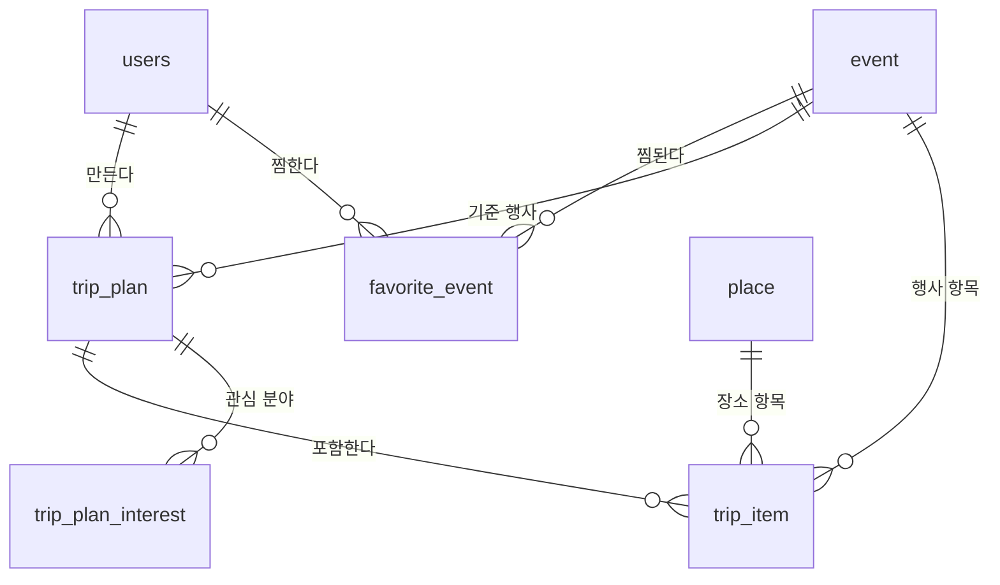

| 테이블 | 내용 |
|---|---|
| `users` | 회원 (이메일, 비밀번호 해시) |
| `event` | 서울시 문화행사 (기간, 시간, 좌표, 분야, 요금, 이미지) |
| `place` | 음식점·카페 (좌표, 음식 분류, 영업시간, 브레이크타임) |
| `favorite_event` | 관심 행사 |
| `trip_plan` | 일정 (초안·저장 상태, 방문일, 추천 조건) |
| `trip_plan_interest` | 일정의 관심 분야 |
| `trip_item` | 일정 항목 (순서, 시작 시각, 머무는 시간, 행사 또는 장소) |

---

## 10. 폴더 구조

```
MINI_PROJECT_1_Local_Culture_Tour_Guide/
├── backend/                 Spring Boot 서버
│   └── src/main/java/com/tripai/backend/
│       ├── controller/      API 입구
│       ├── service/         일정 추천·검색·저장 로직
│       ├── repository/      MyBatis 매퍼
│       ├── domain/          DTO·엔티티
│       ├── external/        서울시 문화행사 OpenAPI 연동
│       ├── scheduler/       행사 수집 배치 (매일 03:00, 첫 적재용 실행 옵션)
│       └── global/          보안·JWT·예외·공통 응답
├── frontend/                React 화면
│   └── src/
│       ├── pages/           로그인·메인·검색·행사 상세·나의 일정·내 여행
│       ├── components/      공통·일정 편집·카드·팝업
│       ├── features/        메인·검색 기능 묶음
│       └── services/        API 호출
├── database/
│   ├── schema/              통합 DDL과 마이그레이션
│   └── seed/                TourAPI 음식점 시드
└── docs/                    협업 규칙, API 계약, 수집 기록, 실행 가이드
```

---

## 11. 로컬 실행 방법

처음 실행하는 순서는 [docs/12_로컬_실행_가이드.md](docs/12_로컬_실행_가이드.md)에 단계별로 정리했습니다. 요약하면 다음과 같습니다.

1. MariaDB에 통합 DDL과 음식점 시드를 적용합니다.
2. `backend/.env`, `frontend/.env`에 DB 접속 정보와 API 키를 넣습니다. (예시 파일 참고, 실제 키는 커밋하지 않습니다.)
3. 백엔드를 실행합니다.

   ```bash
   cd backend && ./gradlew bootRun
   ```

4. 프런트엔드를 실행하고 `http://localhost:5173`에 접속합니다.

   ```bash
   cd frontend && npm install && npm run dev
   ```

처음 한 번은 `backend/.env`에 `BATCH_EVENT_INITIAL_LOAD=true`를 넣고 실행해 서울시 문화행사를 적재한 뒤, 다시 `false`로 되돌립니다. 자세한 내용은 가이드의 5단계에 있습니다.

---

## 12. 팀과 협업 방식

**이강산 · PM**
- 프로젝트 진행 총괄, 프런트엔드 초기 설정(Vite)
- 메인 문화행사 탐색 화면 구현과 월별 행사 조회 API 개발·화면 연동
- 문화행사 조건 검색 API와 검색 결과 화면(로딩·결과 없음 상태 포함) 구현
- 날짜 조건에 맞춘 행사 검색 기본 정렬 개선
- 키워드 검색 팝업 사용성 개선(검색어 해제)과 메인·검색 화면 상단으로 이동
- 날짜·분야·지역 필터 팝업과 조건 필터 디자인 통일, 월별 전환 시 화면 흔들림 방지, 행사 이미지 실패 시 대체 그래픽

**김승진**
- 백엔드 공통 초기 설정과 환경 변수(.env) 적용
- 이메일 로그인·로그아웃 API와 JWT 발급, 토큰 검증 일원화·만료 처리, 회원가입 비회원 접근 허용
- 로그인 화면과 인증 상태 관리, 로그아웃 API가 늦어도 즉시 인증 해제
- TourAPI 서울 음식점 961곳 수집·전처리와 공통 시드 제공, 영업시간·브레이크타임 파서 보완(자정·띄어쓴 표현)
- 음식 종류·식사 시간 필터를 추천과 장소 변경 팝업에 적용
- 통합 테스트 케이스 작성

**박재후**
- 내 여행(마이페이지) 백엔드: 저장한 일정·관심 행사 조회, 일정 이름 변경·삭제 API
- 본인 일정·관심 행사만 수정·삭제하도록 권한 검증과 예외 처리
- 내 여행 화면: 저장 일정·관심 행사 목록과 카드, 상세 보기·새 행사 탐색 이동, 상단 메뉴
- 저장한 일정이나 관심 행사가 없을 때 메인으로 안내하는 빈 상태 화면
- AI 일정 추천 프롬프트와 요청·응답 DTO 작성

**손호성**
- 서울시 문화행사 수집 배치(매일 03:00 자동 갱신)와 온라인 행사 제외 처리
- 행사 상세 조회 API와 행사 상세 화면
- 관심 행사 저장·해제 API와 하트 컴포넌트, 목록 즉시 반영
- 행사 상세에서 일정 만들기·저장한 일정에 행사 추가로 이어지는 흐름
- 공통 예외 처리(ErrorCode·CustomException·GlobalExceptionHandler)
- 통합 DDL v3.2.5와 테이블 명세서, 와이어프레임 작성

**송석주**
- React·Vite 프런트엔드 초기 환경 구성
- 회원가입 API(입력 검증 포함)와 회원가입 화면(목업에서 실제 API 연결까지)
- 로그인·회원가입 화면 UI와 이동 흐름 통일, 로그인 배경 이미지 전환과 용량 최적화
- 월별 행사 선택 시 그달에 시작하는 행사를 먼저 보여 주는 정렬 개선
- 월별 행사 정렬 통합 테스트와 API 문서 갱신
- WBS·간트차트 작성

**홍준서 · 공동 PM**
- 프로젝트 초기 구조와 협업 체계 구축 (브랜치 전략·커밋 컨벤션·PR 템플릿, API 계약 문서, 로컬 실행 가이드)
- 일정 추천 엔진 설계·구현 (행사 시간 고정, 끼니 시간대·영업시간·브레이크타임 규칙, 조건 수정·다시 추천)
- AI 일정 추천 연결 (서버 규칙 검사를 통과할 때만 사용, 실패 시 규칙 기반 대체)과 메인 조건 기반 AI 추천
- 나의 일정 API와 화면 전체 (편집·저장, 빈 시간 장소 추가, 조건 수정 팝업, 카카오 지도 동선)
- 행사 주변 맛집 후보 API, 내 여행 저장 일정 재편집과 일정 카드
- 공통 디자인 컴포넌트, 모든 화면 키워드 검색, 테스트·통합 검증과 팀원 PR 코드 리뷰
- 최종 제출물 (시연 영상, Figma 구성요소·와이어프레임, README)

협업은 다음 규칙으로 진행했습니다.

- `develop` 기준 기능 브랜치를 만들고, PR 템플릿에 작업·이유·확인 내용과 화면을 남긴 뒤 팀원 리뷰를 거쳐 머지했습니다.
- 커밋은 `feat`·`fix`·`docs`·`chore` 등 [커밋 컨벤션](docs/02_커밋컨벤션.md)을 따랐습니다.
- API는 화면 담당과 서버 담당이 계약 문서(docs/07·10·11)로 먼저 맞춘 뒤 구현했습니다.
- 기능이 완성되면 실제 서울시 데이터로 화면 흐름 전체를 다시 확인했습니다.

---

## 13. 문서 목록

| 문서 | 내용 |
|---|---|
| [docs/00 GitHub 기초 가이드](docs/00_github_기초가이드.md) | 처음 참여하는 팀원을 위한 GitHub 사용법 |
| [docs/01 브랜치 전략](docs/01_브랜치전략.md) | 브랜치 이름과 머지 순서 |
| [docs/02 커밋 컨벤션](docs/02_커밋컨벤션.md) | 커밋 메시지 규칙 |
| [docs/03 개발 환경 설정](docs/03_개발환경설정.md) | JDK·Node.js·DB 설치 |
| [docs/04 요구사항 요약](docs/04_프로젝트_요구사항_요약.md) | 기능 목록과 우선순위 |
| [docs/05 API 명세 작성 규칙](docs/05_API_명세_작성규칙.md) | 공통 응답 형식과 오류 코드 |
| [docs/06 자주 묻는 질문](docs/06_자주묻는질문_트러블슈팅.md) | 오류 해결 기록 |
| [docs/07 나의 일정 API 계약](docs/07_나의일정_API_계약.md) | 일정 추천·편집·저장 API |
| [docs/08·09 TourAPI 음식점 수집](docs/09_TourAPI_음식점_수집결과.md) | 음식점 데이터 수집 과정과 결과 |
| [docs/10 문화행사 검색 API 계약](docs/10_문화행사_검색_API_계약.md) | 조건·키워드 검색 |
| [docs/11 메인 월별 행사 API 계약](docs/11_메인페이지_월별행사_API_계약.md) | 월별 행사 |
| [docs/12 로컬 실행 가이드](docs/12_로컬_실행_가이드.md) | 처음부터 끝까지 실행하는 방법 |

GitHub 사용법, 개발 환경 설치, 커밋·파일 관리 규칙처럼 이전 README에 있던 입문 안내는 위 docs/00\~03 문서에 그대로 있습니다.
